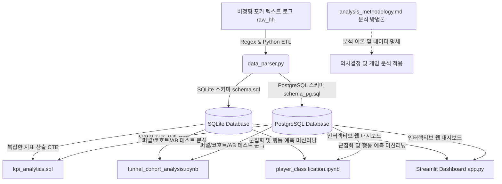

# 🎰 비정형 iGaming 로그 데이터 분석 및 플레이어 행동 분석 플랫폼

이 프로젝트는 <b>비정형 포커 핸드 히스토리 텍스트 로그</b>를 활용하여 데이터의 수집(ETL), 저장(RDBMS), 분석(SQL KPI & Jupyter), 모델링(Machine Learning), 그리고 인터랙티브 시각화(BI Dashboard)까지의 엔드투엔드(End-to-End) 데이터 사이언스 파이프라인을 구축한 데이터 분석 포트폴리오입니다.

포커 게임의 베팅 규칙과 유저 성향을 다각적인 분석 프레임워크(<b>퍼널 분석, 코호트 분석, A/B 테스트, 행동 예측</b>)로 정량화하여 유저의 의사결정 및 게임 플레이 패턴을 도출해내는 데이터 분석 역량을 증명합니다.

---

## 🚀 프로젝트 아키텍처 및 파이프라인

이 프로젝트는 원시 텍스트 로그에서 대시보드 시각화까지 유기적인 듀얼 데이터베이스 파이프라인으로 구성되어 있습니다.



---

## 🛠️ 주요 구성 파일 및 가이드

포트폴리오의 모든 파일은 상세한 주석과 분석적 가치 해설이 한글로 채워져 있어 본인의 지식으로 습득하기 용이합니다.

### 1. [ETL & Database] 듀얼 데이터 인프라 구축
* <b>[schema.sql](file:///c:/Users/gnsl1/Desktop/portfolio/src/schema.sql)</b>: SQLite 로컬 파일 적재용 경량 설계 스키마.
* <b>[schema_pg.sql](file:///c:/Users/gnsl1/Desktop/portfolio/src/schema_pg.sql)</b>: PostgreSQL 엔터프라이즈 서버 적재용 테이블 설계 스키마 (SERIAL 자동 증가 키 적용).
* <b>[data_parser.py](file:///c:/Users/gnsl1/Desktop/portfolio/src/data_parser.py)</b>: 정규표현식(Regex)을 이용해 텍스트 로그를 파싱하고, SQLite와 PostgreSQL의 Upsert 문법 차이를 극복해 두 DB에 동적 분기 적재를 처리하는 ETL 파이프라인.

### 2. [Advanced SQL] 핵심 KPI 지표 산출
* <b>[kpi_analytics.sql](file:///c:/Users/gnsl1/Desktop/portfolio/src/kpi_analytics.sql)</b>: 두 DB 모두와 호환되는 표준 SQL 형태로 튜닝된 쿼리. VPIP, PFR, AF, 승률 지표를 산출하고 유저 성향 세그먼트를 자동 프로파일링합니다.

### 3. [Jupyter Notebooks] 데이터 탐색 및 심화 모델링
* <b>[funnel_cohort_analysis.ipynb](file:///c:/Users/gnsl1/Desktop/portfolio/src/funnel_cohort_analysis.ipynb)</b>:
  * <b>퍼널 분석</b>: 베팅 단계를 깔때기로 구성하여 단계별 유저 전환율 및 이탈율 분석.
  * <b>코호트 분석</b>: 플레이어 성향별 코호트 그룹의 반복 플레이에 따른 리텐션 및 칩 수익 추이 시계열 분석.
  * <b>A/B 테스트</b>: 프리미엄 카드를 잡았을 때 레이즈 여부에 따른 수익 차이 독립표본 T-검정.
* <b>[player_classification.ipynb](file:///c:/Users/gnsl1/Desktop/portfolio/src/player_classification.ipynb)</b>:
  * <b>비지도학습(K-Means)</b>: 다차원 플레이 데이터를 바탕으로 플레이어 군집 자동화.
  * <b>지도학습(Random Forest)</b>: 초기 조건 기반 최종 쇼다운(Showdown) 도달 여부(이진 분류) 예측 모델링.

### 4. [BI Web Dashboard] 시각화 및 데모 애플리케이션
* <b>[app.py](file:///c:/Users/gnsl1/Desktop/portfolio/src/app.py)</b>: Streamlit을 활용해 실행되는 웹 대시보드. 사이드바 설정을 통해 SQLite(로컬 파일)와 PostgreSQL(원격/로컬 서버)을 원클릭으로 전환하여 실시간 모니터링할 수 있는 이중화 인프라를 실현합니다.

### 5. [Analysis Methodology & Glossary] 분석 방법론 및 기술 명세서
* <b>[analysis_methodology.md](file:///c:/Users/gnsl1/Desktop/portfolio/analysis_methodology.md)</b>: 데이터 분석 용어 사전, 알고리즘 개념 해설, 통계 분석법 정리 및 <b>SQLite와 PostgreSQL의 실행 모델 차이 및 마이그레이션 전략</b> FAQ 수록.

---

## 💻 실행 및 확인 방법

프로젝트를 로컬에서 구동하는 순서입니다. (Python 3.8 이상 권장)

### 1. 필수 라이브러리 설치
터미널(PowerShell 또는 CMD)에서 분석에 필요한 라이브러리를 설치합니다. PostgreSQL 드라이버(`psycopg2-binary`)를 포함합니다.
```bash
pip install pandas numpy matplotlib seaborn scipy scikit-learn streamlit plotly psycopg2-binary
```

### 2. 데이터 가공 및 적재 (ETL 실행)
* <b>SQLite 모드 실행 (기본값)</b>:
  `data_parser.py` 상단 설정의 `DB_TYPE = "sqlite"` 상태로 가공합니다.
  ```bash
  cd src
  python data_parser.py
  ```
* <b>PostgreSQL 모드 실행</b>:
  로컬에 PostgreSQL 서버가 구동 중인 상태에서 데이터베이스(`poker_db`)를 미리 생성한 뒤, `data_parser.py` 상단 설정을 `DB_TYPE = "postgres"`로 변경하고 커넥션 정보(`PG_CONN_INFO`)를 세팅하여 실행합니다.
  ```bash
  python data_parser.py
  ```

### 3. 인터랙티브 대시보드 구동
로컬 웹 브라우저 상에서 인터랙티브한 대시보드를 열어 확인합니다.
```bash
streamlit run app.py
```
*(자동으로 `http://localhost:8501` 웹 페이지가 실행되며, 사이드바에서 데이터베이스 엔진을 골라 실시간 로딩 테스트가 가능합니다.)*

---

## 💡 이 프로젝트가 증명하는 분석가의 역량
1. <b>비정형 로그 다루기</b>: 구조화되지 않은 텍스트 데이터를 직접 Regex 파싱하여 RDBMS로 옮기는 실전형 ETL 실무 능력.
2. <b>듀얼 DB 이중화 설계</b>: SQLite와 PostgreSQL의 SQL Dialect 문법 차이를 해결하고 인프라 의존성을 격리하여 유연하게 전환하는 고수준 백엔드 인프라 이해도.
3. <b>도메인 맞춤형 분석 역량</b>: 포커 게임의 규칙과 유저 행동을 단계별 베팅 진행 퍼널로 정의하고, 파산(Bust-out) 시점을 추적해 세션 잔존율을 모델링하는 등 도메인의 고유 속성을 고려해 분석을 설계하는 도메인 친화적인 데이터 사이언스 분석 역량.
4. <b>엄밀한 과학적 검정</b>: A/B 테스트의 핵심인 T-검정을 통한 통계적 유의성 검정 역량 및 변동성/샘플 수 극복을 위한 분석적 대안 제언 역량.
5. <b>전방위 소통 능력</b>: 복잡한 인공지능 모델링과 통계 결과를 웹 대시보드로 직접 개발하여 직관적으로 공유하는 데이터 기반 소통(Data-Driven Communication) 역량.
